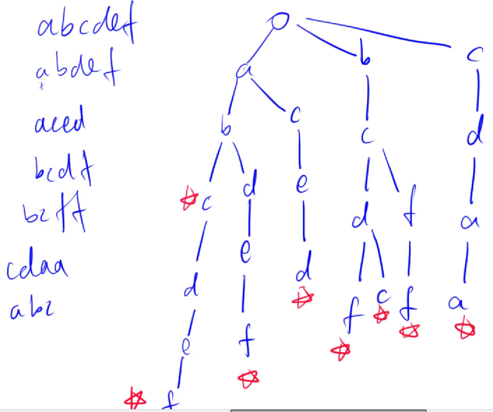

<!--
 * @Author: zhanghao
 * @Date: 2022-12-03 14:39:25
 * @LastEditTime: 2022-12-03 16:10:52
 * @FilePath: /hao_coding/README.md
 * @Description: 
-->

# hao_coding

自己学习数据结构、编程语言、算法的记录

## 01 编程语言

## 02 数据结构

### 第1章 数据结构绪论

#### 01 基本概念和术语

数据结构是互相之间存在一种或多种特定关系的数据元素的集合。

- 数据：其实就是符号，可以进行数值型计算或者非数值处理；
- 数据元素：是组成数据的、有一定意义的基本单位，也被称为记录。比如人（人类的数据元素），牛马（禽类的数据元素）；
- 数据项：一个数据元素可由若干个数据项组成；
- 数据对象：性质相同的数据元素的集合，是数据的子集；
- 数据结构：==是互相之间存在一种或多种特定关系的数据元素的集合==

#### 02 逻辑结构与物理结构

**逻辑结构**：是指数据对象中数据元素之间的相互关系

- 集合结构
- 线性结构
- 树形结构
- 图形结构

**物理结构**：是指数据的逻辑结构在计算机中的存储形式

- 顺序存储结构
- 链式存储结构

#### 03 抽象数据类型

数据类型：是指一组性质相同的值的集合及定义在此集合上的一些操作的总称；

在C语言中，数据类型可以分为两类：

- 原子类型：不可再分解的基本类型，包括整形、实型、字符型等；
- 结构类型：由若干个类型组成，是可以再分解得到。整形数组事由若干整形数据组成。

==抽象数据类型是指一个数学模型及定义在改模型上的一组操作==，抽象的意义在于数据类型的数学抽象特性；


### 第2章 算法

#### 01 两种算法比较

从1加到100两种做法：

```cpp
int i,sum = 0, n = 100;
for(int i = 0; i < 100; i++)
{
    sum = sum + i;
}
printf(" %d",sum);
```

```cpp
int sum = 0,n = 100
sum = (1 + n)*n/2;
printf("%d",sum);
```

#### 02 算法定义

`algorithm`算法是解决特定问题求解步骤的描述，在计算机中表现为指令的有限序列，并且每条指令表示一个或多个操作。

#### 03 算法的特性

五个基本特性：输入，输出，有穷性，确定性，可行性；

#### 04 算法设计要求

正确性，可读性，健壮性，时间效率高和存储量低

#### 05 算法效率的度量方法

事后统计法；事前分析估算法

#### 06 函数渐进增长

给定两个函数f(n)和g(n)，如果存在一个整数N，使得对于所有的n>N,f(n)总是比g(n)大，那么我们说前者增长渐进快于后者；

#### 07 算法时间复杂度

算法的时间复杂度，也就是算法ed时间度量，记作：T(n) = O(f(n));

#### 08 常见的时间复杂度

常数阶 线性阶 平方阶 对数阶 nlogn阶 立方阶 指数阶
$$
O(1) < O(logn) < O(n) < O(nlogn) < O(n^2) < O(n^3) < O(2^n) < O(n!) < O(n^n)
$$

#### 09 算法空间复杂度

算法的空间复杂度通过计算算法所需的存储空间实现，算法空间复杂度的计算公式记作：S(n) = O(f(n))

### 第3章 线性表

#### 01 线性表的定义

零个或多个数据元素的有限序列。在较复杂的线性表中，一个数据元素可以由若干个数据项组成。

#### 02 线性表的抽象数据结构

```cpp
//单链表
//head 存储链表头， e[]存储节点的值， ne[]存储节点的next指针，idx表示当前用到了哪个节点。
int head, e[N],ne[N],idx;
//初始化
void init()
{
    head = -1;
    idx = 0;
}
//在链表头插入一个数a
void insert(int a)
{
    e[idx] = a, ne[idx] = head, head = idx++;
}
//将头节点删除，需要保证头节点存在
void remove()
{
    head = ne[head];
}
```

```c++
//双链表
//e[] 表示节点的值，l[]表示节点的左指针，r[]表示节点的右指针，idx表示当前用到了哪个节点。
int e[N],l[N],r[N],idx;
//初始化
void init()
{
	//0是左端点，1是右端点
	r[0]=1,l[1]=0;
	idx = 2;
}
//在节点a的右边插入一个数x
void insert(int a, int x)
{
    e[idx]=x;
    l[idx]=a,r[idx]=r[a];
    l[r[a]] = idx,r[a] = idx++;
}
//删除节点a
void remove(int a)
{
    l[r[a]] = l[a];
    r[l[a]] = r[a];
}
```

#### 03 线性表的顺序存储结构

线性表的顺序存储结构，指的是用一段地址连续的存储单元依次存储线性表的数据元素。线性表的长度小于等于数组的长度。

#### 04 顺序存储结构得到插入与删除


#### 05 线性表的链式存储结构

#### 06 单链表的读取

#### 07 单链表的插入与删除

#### 08 单链表的整表创建、删除

#### 09 单链表结构与顺序存储结构优缺点

#### 10 静态链表

#### 11 循环链表

#### 12 双向链表

### 第4章 栈与队列

#### 01 栈的定义

栈树限定仅在表尾进行插入和删除操作的线性表。队列是只允许在一端进行插入操作、而在另一端进行删除操作的线性表。我们把允许插入和删除的一端称为栈顶（top），另一端称为栈底（bottom），不含任何数据元素的栈称为空栈。栈又称为后进先出（Last In First Out）的线性表，简称LIFO结构。

栈的插入操作，叫做进栈，也称压栈、入栈。

栈的删除操作，叫做出栈，也有的叫做弹栈。

#### 02 栈的抽象数据类型

对于栈来讲，理论上线性表得 操作特性它都具备，可由于它的特殊性，操作会有些变化。特别是插入和删除操作。栈本身就是一个线性表，之前讨论的 线性表的顺序存储和链式存储对于栈来讲同样适用。

#### 03 栈的顺序存储结构及实现

#### 04 两栈共享空间


#### 05 栈的链式存储结构

#### 06 栈的作用

#### 07 栈的应用——递归+四则运算表达式

#### 08 队列定义

#### 09 队列抽象数据类型

#### 10 循环队列

#### 11 队列的链式存储结构及实现

### 第5章 串

#### 01 串的定义

#### 02 串的比较

#### 03 串的抽象数据类型

#### 04 串的存储结构

#### 05 朴素的模式匹配算法

#### 06 KMP模式匹配算法

### 第6章 树

#### 01 树的定义

树的定义其实就是我们在讲解栈时提到的递归的方法。也就是树的定义之中还用到了树的概念。

一些概念：

- 结点拥有的子树数称为结点的度（Degree）
- 度为零的结点称为叶结点或终端结点；
- 度不为零的结点称为非终端结点或分支结点；
- 除根节点之外，分支结点也称为内部结点；
- 树的度是树内各结点的度的最大值；
- 双亲、孩子、兄弟、子孙；
- 结点的层次从根开始定义，根为第一层，根的孩子为第二层；
- 树中结点的最大层次称为树的深度或高度；
- 树中结点的各子树看成从左到右是有次序的，不能互换的，则称有序树，否则无序树；
- 森林是m(m>=0)颗互不相交的树的集合；

#### 02 树的抽象数据类型


##### 1 trie树

```c++
#include<iostream>
using namespace std;
const int N = 100010;
int son[N][26],cnt[N],idx; //下标是0的点即使根节点又是空节点
char str[N];
void insert(char *str)  // 存储也就是插入字符串
{
    int p = 0;
    for (int i = 0; str[i]; i ++ ) //因为字符串的最后一个字符为\0 所以可以用str[i]来
    {
        int u = str[i] - 'a';   //小写字母a-z映射到0-25
        if (!son[p][u]) son[p][u] = ++ idx;
        p = son[p][u];
    }
    cnt[p] ++ ; //以这个点结尾的字母多了一个
}

int query(char *str)  // 查询字符串出现次数
{
    int p = 0;
    for (int i = 0; str[i]; i ++ )
    {
        int u = str[i] - 'a';
        if (!son[p][u]) return 0;
        p = son[p][u];
    }
    return cnt[p];
}
int main()
{
    int n;
    cin >> n;
    while (n -- )
    {
        char op[2];
        scanf("%s%s",op,str);
        if(op[0] == 'I') insert(str);
        else printf("%d\n",query(str));
    }
    return 0;
}
```


#### 03 树的存储结构

#### 04 二叉树的定义、性质、存储结构

#### 05 遍历二叉树

#### 06 二叉树的建立

#### 07 线索二叉树

#### 08 树、森林与二叉树的转换

#### 09 赫夫曼树及其应用

#### 10 trie树

==用来高效快速存储查找字符串集合的数据结构==

adcdef abdef aced                                bcdf bcff cdaa bcdc abc



想查找aced 查找结束并且有一个标记，所以查找到。==路径有无以及有无标记==

```c++
#include<iostream>
using namespace std

```


### 第7章 图

#### 01 图的定义

#### 02 图的抽象数据结构

#### 03 图的存储结构

#### 04 图的遍历

#### 05 最小生成树

#### 06 最短路径

#### 07 拓扑排序

#### 08 关键路径

### 第8章 查找

#### 01 查找概论

#### 02 顺序表查找

#### 03 有序表查找

#### 04 线性索引查找

#### 05 二叉排序树

#### 06 平衡二叉树（AVL树）

#### 07 多路径查找（B树）

#### 08 散列表查找（哈希表）

#### 09 散列函数的构造方法

#### 10 处理散列冲突的方法

#### 11 散列表的查找实现

### 第9章 排序

#### 01 排序的基本概念与分类

#### 02 冒泡排序

#### 03 简单选择排序

#### 04 直接插入排序

#### 05 希尔排序

#### 06 堆排序

#### 07 归并排序

#### 08 快速排序

## 03 算法

while (~scanf("%d%d",&m,&n))什么用的？
　　ACM中比较常见，其功能是循环从输入流读取m和n，直到遇到EOF为止，等同于while (scanf("%d%d",&m,&n)!=EOF)。

　　scanf()函数返回成功赋值的数据项数，出错时则返回，EOF定义为-1。~是按位取反，-1十六进制补码表示为0x ffffffff，f是二进制的1111，取反后就全部变成0了，于是while结束。只有返回值为EOF（即-1）时，其取反的的值（即while循环的判断条件）才为0，才能结束循环，其它输入情况下（无论是否输入成功）while循环的判断条件为非0，即为真。
dxse
　　这种写法的漏洞在于：一但输入的值为字母、符号之类的，scanf赋值不成功把读到的内容又返回到stdin的缓冲区（假设这个值为t），其取反得到的值使while又进入到下一次循环，scanf又从stdin缓冲区里读到了原先吐回的t，如此成了死循环……

TODO:代办事项


HACK:不确定标记


NOTE：笔记

BUG：有bug

TAG：打个标签

XXX：随便写写